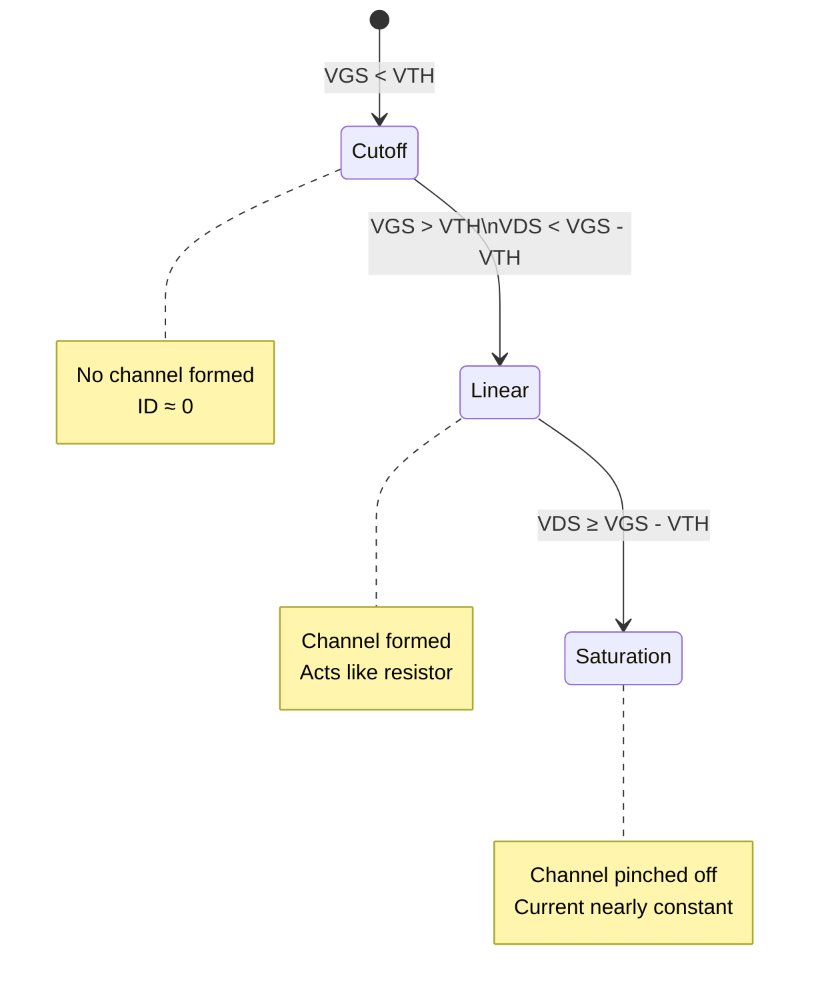

## 1. Structure of a MOSFET

```svg
<svg viewBox="0 0 600 300" xmlns="http://www.w3.org/2000/svg">
  <!-- NMOS -->
  <g transform="translate(50,50)">
    <text x="100" y="0" font-size="20" font-weight="bold">NMOS</text>
    <!-- Substrate -->
    <rect x="0" y="100" width="200" height="100" fill="#ddd" />
    <text x="85" y="150" font-size="14">P-Substrate</text>
    
    <!-- Source and Drain -->
    <rect x="20" y="80" width="40" height="40" fill="#aaf" />
    <rect x="140" y="80" width="40" height="40" fill="#aaf" />
    <text x="25" y="105" font-size="12">N+</text>
    <text x="145" y="105" font-size="12">N+</text>
    
    <!-- Gate -->
    <rect x="70" y="60" width="60" height="20" fill="#888" />
    <text x="85" y="75" font-size="12" fill="white">Gate</text>
    
    <!-- Labels -->
    <text x="30" y="140" font-size="12">Source</text>
    <text x="150" y="140" font-size="12">Drain</text>
  </g>
  
  <!-- PMOS -->
  <g transform="translate(300,50)">
    <text x="100" y="0" font-size="20" font-weight="bold">PMOS</text>
    <!-- Substrate -->
    <rect x="0" y="100" width="200" height="100" fill="#fee" />
    <text x="85" y="150" font-size="14">N-Well</text>
    
    <!-- Source and Drain -->
    <rect x="20" y="80" width="40" height="40" fill="#faa" />
    <rect x="140" y="80" width="40" height="40" fill="#faa" />
    <text x="25" y="105" font-size="12">P+</text>
    <text x="145" y="105" font-size="12">P+</text>
    
    <!-- Gate -->
    <rect x="70" y="60" width="60" height="20" fill="#888" />
    <text x="85" y="75" font-size="12" fill="white">Gate</text>
    
    <!-- Labels -->
    <text x="30" y="140" font-size="12">Source</text>
    <text x="150" y="140" font-size="12">Drain</text>
  </g>
</svg>

```

## 2. CMOS Technology

CMOS (Complementary MOS) technology allows both NMOS and PMOS transistors to coexist on the same chip:
- An n-well is grown inside a p-substrate
- This creates the foundation for complementary transistor operation
- Essential for modern integrated circuits

## 3. Channel Formation

The channel formation process occurs in several steps:
1. A positive gate voltage is applied (for NMOS)
2. Holes are repelled from the gate area
3. Negative ions are left behind, forming a depletion region
4. Electrons are attracted to the interface
5. An inversion layer (channel) is created

## 4. MOSFET Characteristics

Key characteristics are measured by:
- Varying VG (gate voltage) while keeping VD (drain voltage) constant
- Varying VD while keeping VG constant
- The channel resistance varies with applied voltage (VCR - Voltage Controlled Resistance)

## 5. Effect of Length (L) and Width (W)

Important dimensional effects:
- **Gate Length (L)**:
  - Smaller L → Lower channel resistance
  - Lower resistance → Higher drain current
- **Gate Width (W)**:
  - Larger W → Higher current
  - Larger W → Higher gate capacitance
  - Width increase is equivalent to parallel devices
  - Trade-off between current drive and speed

## 6. Operating Regions




### Operating Region Equations:

1. **Linear/Triode Region** (VDS < VGS - VTH):
```
ID = μnCox(W/L)[(VGS - VTH)VDS - (VDS²/2)]
```

2. **Saturation Region** (VDS ≥ VGS - VTH):
```
ID = (1/2)μnCox(W/L)(VGS - VTH)²(1 + λVDS)
```

## 7. Secondary Effects

### Channel-Length Modulation
- Current in saturation region varies slightly with VD
- Channel endpoint moves toward source as VD increases
- Modeled by factor (1 + λVDS)

### Body Effect
- Threshold voltage changes with source-to-bulk voltage
- Described by equation:
```
VTH = VTH0 + γ(√(2ΦF + VSB) - √(2ΦF))
```

### Velocity Saturation
- Occurs in very short channels
- Drain current becomes linear with gate voltage
- Important in modern short-channel devices

### Sub-threshold Conduction
- Weak inversion occurs below threshold
- Results in small but non-zero current
- Important for low-power applications
